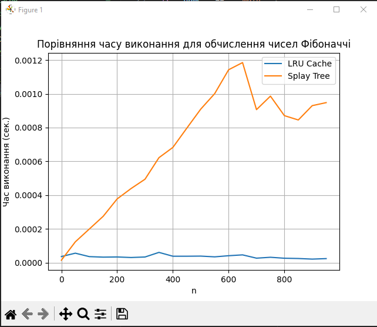

### task 1

Оптимізація доступу до даних за допомогою LRU-кешу та без кешування

Результат:

```
Час виконання без кешування: 3.84 секунд
Час виконання з LRU-кешем: 3.64 секунд
```

Висновок:
Тестовий випадок не продемонстрував переваг використання LRU-кешу

### task 2

Результати порівняння часу виконання для LRU Cache та Splay Tree



<details>
<summary>Показати таблицю результатів</summary>

| n   | LRU Cache (сек.) | Splay Tree (сек.) |
|-----|------------------|-------------------|
| 0   | 3.6e-05          | 1.43e-05          |
| 50  | 5.58e-05         | 0.0001231         |
| 100 | 3.55002e-05      | 0.0001987         |
| 150 | 3.24e-05         | 0.0002744         |
| 200 | 3.34e-05         | 0.0003773         |
| 250 | 3.02e-05         | 0.0004389         |
| 300 | 3.32e-05         | 0.0004941         |
| 350 | 6.04999e-05      | 0.0006218         |
| 400 | 3.78001e-05      | 0.0006826         |
| 450 | 3.78001e-05      | 0.0007968         |
| 500 | 3.84999e-05      | 0.0009096         |
| 550 | 3.40999e-05      | 0.0010013         |
| 600 | 4.08001e-05      | 0.0011428         |
| 650 | 4.58001e-05      | 0.0011853         |
| 700 | 2.62999e-05      | 0.0009065         |
| 750 | 3.16e-05         | 0.0009865         |
| 800 | 2.58998e-05      | 0.0008709         |
| 850 | 2.43001e-05      | 0.0008452         |
| 900 | 2.07e-05         | 0.0009301         |
| 950 | 2.36998e-05      | 0.000948          |


</details>
